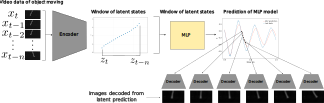

# On-learning-extremely-low-dimensional-dynamics-of-deformable-objects-from-experimental-video-data

This repository is for the code accompaning the paper "On learning extremely low dimensional dynamics of deformable objects from experimental video data", submitted to Learning for Dynamics and control 2023. 

It contains the experimental data used in the paper, the code for processing, the script used to train the VAE models and script for training the MLP in the latent space. 

## Overview of overall architecture 

